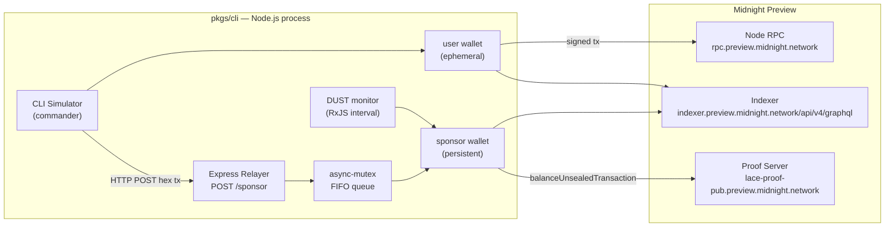
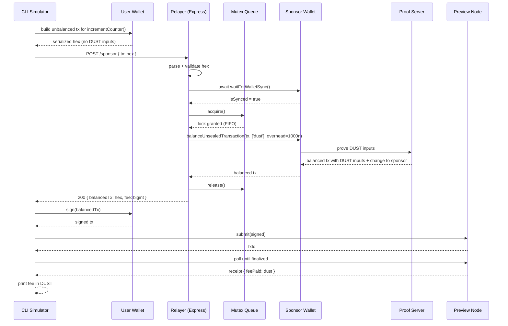
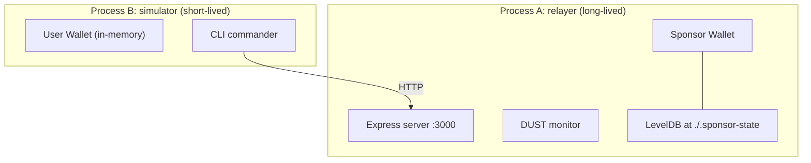

# Design Document: DustRegen Relayer

## Overview

The DustRegen Relayer is a CLI-driven, sponsored gas relayer for the Midnight
Network Preview testnet. Its purpose is to let an unfunded user wallet (zero
NIGHT, zero DUST) execute a contract call against a deployed Compact contract
by having a persistent **Sponsor Wallet** inject DUST inputs into the user's
unbalanced transaction. The user signs the resulting balanced transaction
locally, never surrendering custody, and submits it to a Preview node.

The system is structured as a TypeScript monorepo with two workspaces:

- `pkgs/contract/` — the Compact `test-call.compact` contract plus the
  generated TypeScript bindings, ZK keys, and ZKIR produced by
  `compactc 0.31.0` (language `0.23.0`, runtime `0.16.0`).
- `pkgs/cli/` — an Express-based relayer service plus a CLI simulator that
  exercises the full sponsorship flow end-to-end.

The relayer enforces three invariants at every entry point:

1. **Sync-before-balance** — `balanceUnsealedTransaction` is only called after
   `wallet.state()` has emitted `isSynced === true`.
2. **Single-flight balancing** — concurrent `/sponsor` requests are serialized
   through an in-memory FIFO mutex to prevent UTXO collisions on the sponsor's
   DUST inputs.
3. **Non-custodial signing** — the user's signing key never leaves the CLI
   process; only an *unbalanced* (unsigned, no DUST) transaction is posted to
   the relayer.

### Key Design Decisions and Rationale

| Decision | Rationale |
|---|---|
| Express instead of Fastify/Hapi | Smallest learning surface, idiomatic for the Midnight SDK examples, already pinned in `pkgs/cli/package.json`. |
| LevelDB private state via `@midnight-ntwrk/level-private-state-provider` | Required for persistent witness-state across relayer restarts; avoids re-syncing from genesis. |
| In-memory `async-mutex` queue | The relayer is a single-process service for the hackathon; a distributed lock would be premature. The mutex is the smallest construct that solves the UTXO-collision requirement. |
| `tokenKindsToBalance: ['dust']` only | Sponsor adds DUST inputs but never NIGHT inputs — the user's contract call is responsible for any NIGHT it moves. |
| DUST change routed to sponsor's own public key | Returning change to the user would create a NIGHT-less, DUST-bearing UTXO the user cannot spend; routing to the sponsor preserves the battery. |
| `additionalFeeOverhead = 1_000n` Specks | Matches the `dapp-connector-api` v4.x example defaults and absorbs proof-server jitter without over-collateralizing the sponsor. |
| RxJS `firstValueFrom(filter(isSynced))` with timeout | The wallet SDK exposes `state()` as an Observable; converting to a Promise with timeout is the canonical pattern in the Midnight examples. |

## Architecture

### Component Topology



### Sponsorship Sequence (happy path)



### Process Model

A single Node.js process hosts both the Express relayer and the persistent
sponsor wallet. The CLI simulator runs in a separate Node.js process (or via
`npm run dev`) and talks to the relayer over loopback HTTP. This separation
matters because the simulator's user wallet is **ephemeral and unfunded** — it
must not share private-state storage with the sponsor.



## Components and Interfaces

The `pkgs/cli/src/` tree is organized into the subfolders mandated by the
requirements. Each module has a single responsibility and exposes a narrow
TypeScript interface to its callers.

```
pkgs/cli/src/
├── index.ts                   # entry point: `relayer` | `simulate` subcommands
├── config/
│   └── network.ts             # NetworkConfig, env loader, validation
├── wallet/
│   ├── sponsor.ts             # buildSponsorWallet(), waitForWalletSync()
│   └── user.ts                # buildEphemeralUserWallet()
├── transaction/
│   ├── codec.ts               # serializeTx(), deserializeTx()
│   └── sign.ts                # signBalancedTx()
├── queue/
│   └── mutex.ts               # SponsorMutex (async-mutex wrapper)
├── relayer/
│   ├── server.ts              # Express app factory
│   └── routes/sponsor.ts      # POST /sponsor handler
├── monitor/
│   └── dust.ts                # DustMonitor (RxJS interval over wallet.state())
└── simulator/
    └── flow.ts                # 6-step end-to-end script
```

### config/network.ts

Loads, validates, and exposes the Preview network configuration. Validation
runs once at startup; failure throws `ConfigurationError`.

```typescript
export interface NetworkConfig {
  readonly networkId: 'Preview';
  readonly nodeRpcUrl: string;            // https://rpc.preview.midnight.network
  readonly indexerUrl: string;            // https://indexer.preview.midnight.network/api/v4/graphql
  readonly indexerWsUrl: string;          // wss://indexer.preview.midnight.network/api/v4/graphql/ws
  readonly proofServerUrl: string;        // https://lace-proof-pub.preview.midnight.network
  readonly contractAddress: string;       // 0x… for the deployed test-call contract
  readonly sponsorSeed: string;           // BIP-39 mnemonic, redacted from logs
  readonly privateStateDir: string;       // LevelDB directory, e.g. ./.sponsor-state
  readonly walletSyncTimeoutMs: number;   // default 120_000
  readonly relayerPort: number;           // default 3000
  readonly additionalFeeOverhead: bigint; // default 1_000n
}

export function loadNetworkConfig(env = process.env): NetworkConfig;
```

The loader rejects any config in which `networkId !== 'Preview'`, any URL that
fails `new URL()`, or any missing seed phrase. The seed phrase is read from
`SPONSOR_SEED` and **never echoed**; the logger formatter strips fields whose
key matches `/seed|mnemonic|private/i`.

### wallet/sponsor.ts

Owns the persistent sponsor wallet's lifecycle.

```typescript
import { type Wallet } from '@midnight-ntwrk/wallet';
import { type WalletState } from '@midnight-ntwrk/wallet-api';
import { firstValueFrom, filter, timeout, throwError, catchError } from 'rxjs';

export interface SponsorWallet {
  readonly wallet: Wallet;
  readonly publicKey: string;        // sponsor's coin public key (DUST change destination)
  readonly nativeAddress: string;    // logged on startup
  close(): Promise<void>;
}

export async function buildSponsorWallet(cfg: NetworkConfig): Promise<SponsorWallet>;

export async function waitForWalletSync(
  wallet: Wallet,
  timeoutMs: number,
): Promise<WalletState>;

export async function verifyDustRegistration(state: WalletState): Promise<void>;
```

`buildSponsorWallet` wires the LevelDB private-state provider, restores the
wallet from the seed phrase, and starts the wallet's internal sync loop.

`waitForWalletSync` is a thin RxJS wrapper:

```typescript
return firstValueFrom(
  wallet.state().pipe(
    filter((s) => s.syncProgress?.synced === true),
    timeout({
      each: timeoutMs,
      with: () => throwError(() => new WalletSyncTimeoutError(timeoutMs)),
    }),
  ),
);
```

`verifyDustRegistration` walks the synced state and asserts that at least one
cNIGHT input exists with a live `DustRegistration`, which is the precondition
for `balanceUnsealedTransaction` to be able to fund DUST. If none exists the
function throws `InsufficientDUSTBalanceError` with the wallet's current
NIGHT/DUST snapshot.

### wallet/user.ts

```typescript
export interface EphemeralUserWallet {
  readonly wallet: Wallet;
  readonly secretKey: Uint8Array;     // never leaves this process
  readonly publicKey: string;
  readonly nativeAddress: string;
  close(): Promise<void>;
}

export async function buildEphemeralUserWallet(
  cfg: NetworkConfig,
): Promise<EphemeralUserWallet>;
```

The user wallet is created with a freshly generated entropy and an in-memory
private-state provider; it deliberately holds zero NIGHT and zero DUST. Sync
still runs to populate the indexer's view of the (empty) wallet state, which
is required for transaction construction.

### transaction/codec.ts

```typescript
import { type UnbalancedTransaction, type BalancedTransaction }
  from '@midnight-ntwrk/dapp-connector-api';

export function serializeUnbalanced(tx: UnbalancedTransaction): string; // hex
export function deserializeUnbalanced(hex: string): UnbalancedTransaction;

export function serializeBalanced(tx: BalancedTransaction): string;
export function deserializeBalanced(hex: string): BalancedTransaction;
```

These wrap `@midnight-ntwrk/ledger-v8` serialization. The hex string format is
chosen because the `/sponsor` endpoint's request and response bodies must be
JSON-safe; base64 would also work but hex is cheaper to log when debugging.

### transaction/sign.ts

```typescript
export async function signBalancedTx(
  wallet: Wallet,
  balancedTxHex: string,
): Promise<string>; // hex of fully signed, submittable tx
```

Signing happens entirely on the user side; the relayer never touches the
user's signing key.

### queue/mutex.ts

```typescript
import { Mutex, type MutexInterface } from 'async-mutex';

export class SponsorMutex {
  private readonly mutex = new Mutex(); // FIFO by construction in async-mutex
  async runExclusive<T>(label: string, fn: () => Promise<T>): Promise<T>;
  get pending(): number;                 // for /health visibility
}
```

`async-mutex` guarantees FIFO ordering of `acquire()` callers, which is the
property the requirements pin down. `runExclusive` logs `acquire`/`release`
pairs with the `label` and the wait time so we can prove ordering in tests.

### relayer/routes/sponsor.ts

```typescript
import { z } from 'zod'; // small validation dep already present in node ecosystem

export const SponsorRequest = z.object({
  unbalancedTx: z.string().regex(/^[0-9a-fA-F]+$/, 'must be hex'),
});
export type SponsorRequest = z.infer<typeof SponsorRequest>;

export type SponsorResponse =
  | { ok: true; balancedTx: string; estimatedFee: string /* bigint as decimal */ }
  | { ok: false; error: { code: ErrorCode; message: string; details?: unknown } };
```

Handler outline:

```typescript
async function handleSponsor(req, res) {
  const parsed = SponsorRequest.safeParse(req.body);
  if (!parsed.success) return res.status(400).json(toError('TransactionParseError', parsed.error));

  const tx = deserializeUnbalanced(parsed.data.unbalancedTx); // throws TransactionParseError

  await waitForWalletSync(sponsor.wallet, cfg.walletSyncTimeoutMs); // throws WalletSyncTimeoutError

  return mutex.runExclusive('sponsor', async () => {
    const state = await firstValueFrom(sponsor.wallet.state());
    assertDustSufficient(state, tx, cfg.additionalFeeOverhead); // throws InsufficientDUSTBalanceError or InsufficientFeeError

    const balanced = await sponsor.wallet.balanceUnsealedTransaction(tx, {
      tokenKindsToBalance: ['dust'],
      changeOutputDestination: sponsor.publicKey,
      additionalFeeOverhead: cfg.additionalFeeOverhead,
    }); // any thrown error is wrapped as BalanceError

    return res.json({
      ok: true,
      balancedTx: serializeBalanced(balanced),
      estimatedFee: balanced.estimatedFee.toString(),
    });
  });
}
```

A top-level Express error middleware maps any thrown `RelayerError` subclass
to the appropriate HTTP status (see Error Handling).

### monitor/dust.ts

```typescript
export interface DustSnapshot {
  readonly takenAt: Date;
  readonly nightStars: bigint;     // 1 NIGHT = 10^6 Stars
  readonly dustSpecks: bigint;     // 1 DUST = 10^15 Specks
  readonly dustCapacitySpecks: bigint; // 5 * NIGHT (in DUST units, expressed in Specks)
  readonly capacityPct: number;        // dust / capacity, 0..1
  readonly regenSpecksPerSecond: bigint; // 8267n * nightStars
}

export class DustMonitor {
  start(intervalMs: number): void;
  stop(): void;
  current(): DustSnapshot | null;
}
```

The monitor subscribes to `wallet.state()` and every `intervalMs` (default
10 s) publishes a `DustSnapshot`. When `dustSpecks < 0.5 * 10^15n` it logs
`level: 'warn'` with the `LowDustBalance` event. The conversion math is done
once in `monitor/dust.ts` and re-used by tests (see Correctness Property 2).

### simulator/flow.ts

The 6-step CLI flow, executed by `npm run dev simulate`:

1. `buildEphemeralUserWallet(cfg)` — fresh wallet, zero balances.
2. `waitForWalletSync(user.wallet, timeout)` — sync against the indexer.
3. Build `incrementCounter()` call against the deployed test contract using
   the contract bindings from `pkgs/contract/dist/managed/test-call/...`,
   producing an `UnbalancedTransaction`.
4. `serializeUnbalanced` and `POST /sponsor`.
5. `signBalancedTx(user.wallet, response.balancedTx)`.
6. Submit the signed tx to the Preview node, poll for finalization, log
   `feePaid` in DUST (Specks divided by 10^15 with full precision).

## Data Models

### NetworkConfig

(See `config/network.ts` above.) All fields are required; defaults are applied
for optional ones (`walletSyncTimeoutMs`, `relayerPort`, `additionalFeeOverhead`).

### TxEnvelope (wire format on `/sponsor`)

```typescript
// request
{ unbalancedTx: string /* lowercase hex */ }

// response (success)
{ ok: true; balancedTx: string; estimatedFee: string }

// response (failure)
{ ok: false; error: { code: ErrorCode; message: string; details?: unknown } }
```

### DustSnapshot

(See `monitor/dust.ts` above.) Stored only in memory; re-derived from
`wallet.state()` on each tick.

### BatteryModel constants

```typescript
export const STARS_PER_NIGHT = 1_000_000n;          // 10^6
export const SPECKS_PER_DUST = 1_000_000_000_000_000n; // 10^15
export const REGEN_SPECKS_PER_STAR_PER_SEC = 8_267n;
export const DUST_CAP_PER_NIGHT_IN_SPECKS = 5n * SPECKS_PER_DUST; // 5 DUST per 1 NIGHT
export const LOW_DUST_THRESHOLD_SPECKS = SPECKS_PER_DUST / 2n;    // 0.5 DUST
```

These constants are the *only* place magic numbers appear; every other module
imports them.

### ErrorCode (closed set)

```typescript
export type ErrorCode =
  | 'WalletSyncTimeoutError'
  | 'InsufficientDUSTBalanceError'
  | 'TransactionParseError'
  | 'BalanceError'
  | 'NetworkSubmissionError'
  | 'ConfigurationError'
  | 'InsufficientFeeError';
```

Adding a new error is a typed change that forces every handler to update,
which is intentional.


## Correctness Properties

*A property is a characteristic or behavior that should hold true across all
valid executions of a system — essentially, a formal statement about what the
system should do. Properties serve as the bridge between human-readable
specifications and machine-verifiable correctness guarantees.*

The following properties were derived from the prework classification and
consolidated to remove redundancy. Each will be implemented as a single
property-based test running ≥100 iterations, tagged
`Feature: dust-regen-relayer, Property N: <text>`.

### Property 1: Counter increment is +1 for any prior state

*For any* starting counter value `c0`, after invoking `incrementCounter()` on
the test contract the resulting counter equals `c0 + 1`.

**Validates: Requirements 1.3**

### Property 2: Wallet sync resolves on first synced emission, else times out

*For any* sequence of `wallet.state()` emissions consisting of `n ≥ 0`
non-synced events optionally followed by a synced event, `waitForWalletSync`
resolves with the synced state if and only if a synced event is emitted within
the configured timeout, and otherwise throws `WalletSyncTimeoutError`.

**Validates: Requirements 2.1, 2.2, 2.3, 8.2**

### Property 3: DUST registration is verified iff a live cNIGHT input exists

*For any* synced wallet state `s`, `verifyDustRegistration(s)` succeeds if and
only if `s` contains at least one live `DustRegistration` referencing a cNIGHT
input and the wallet's DUST balance is strictly positive; otherwise it throws
`InsufficientDUSTBalanceError`.

**Validates: Requirements 2.4, 2.5**

### Property 4: Transaction serialization round-trip and parse rejection

*For any* valid `UnbalancedTransaction` or `BalancedTransaction` value `tx`,
`deserialize(serialize(tx))` is structurally equivalent to `tx`. Conversely,
*for any* hex string that is not the serialization of a valid transaction,
`deserialize` throws `TransactionParseError` and the `/sponsor` endpoint
returns HTTP 400 with `error.code === 'TransactionParseError'`.

**Validates: Requirements 4.2, 4.6, 8.4, 9.2, 10.3, 10.4, 11.1, 11.2, 11.3**

### Property 5: DUST sufficiency gate is exact

*For any* sponsor DUST balance `d` and estimated base fee `f`, the `/sponsor`
handler proceeds with `balanceUnsealedTransaction` if and only if
`d ≥ f + additionalFeeOverhead`; otherwise it returns either
`InsufficientDUSTBalanceError` (when `d` cannot cover even the overhead) or
`InsufficientFeeError` (when `d` covers the overhead but not the full fee).

**Validates: Requirements 4.3, 4.7, 7.1, 7.2, 7.3**

### Property 6: DUST change is always routed to the sponsor

*For any* balanced transaction returned by the `/sponsor` endpoint, every DUST
change output's destination public key equals `sponsor.publicKey`.

**Validates: Requirements 4.5**

### Property 7: Sponsorship queue is FIFO, mutually exclusive, and live

*For any* set of `N` sponsorship requests submitted concurrently, where each
request's underlying balancing call is either successful or failing:

1. The order in which the mutex executes the balancing calls equals their
   submission order (FIFO).
2. The number of in-flight balancing calls never exceeds 1.
3. After all `N` requests settle, the mutex's pending count is 0 (the queue
   drains regardless of individual successes or failures).

**Validates: Requirements 5.1, 5.2, 5.3, 5.4**

### Property 8: DUST conservation across a successful sponsorship

*For any* successful sponsorship that yields a balanced transaction with paid
fee `F`, the sponsor wallet's DUST balance after settlement equals its balance
before the request minus `F` (subject only to additional regeneration accrued
between the two snapshots).

**Validates: Requirements 6.2**

### Property 9: Battery-model math is closed-form correct

*For any* `(currentDustSpecks, nightStars, elapsedSeconds)` triple:
- `projectedDust` equals `min(currentDustSpecks + 8267 * nightStars * elapsedSeconds, 5 * nightStars * 10^15 / 10^6)`.
- `capacityPct` equals `projectedDust / capacity` and lies in `[0, 1]`.
- `isLowDust(currentDustSpecks)` is true if and only if
  `currentDustSpecks < SPECKS_PER_DUST / 2`.

**Validates: Requirements 6.1, 6.3, 6.4**

### Property 10: Error context preserved and sponsor seed never leaks

*For any* thrown `RelayerError` `e`, the JSON response produced by the error
middleware contains `error.code === e.code` and either `error.message` or
`error.details` includes `e.message`. Conversely, *for any* string passed
through the redacting logger or returned through the API, if the string
contains the configured `SPONSOR_SEED`, the serialized output does not
contain that seed.

**Validates: Requirements 9.5, 10.1**

### Property 11: Ephemeral user wallets have zero balances at construction

*For any* valid `NetworkConfig`, an ephemeral user wallet built by
`buildEphemeralUserWallet(cfg)` reports `nightStars === 0n` and
`dustSpecks === 0n` immediately after `waitForWalletSync` resolves.

**Validates: Requirements 8.1**

### Property 12: Configuration validation accepts only well-formed inputs

*For any* candidate `(nodeRpcUrl, indexerUrl, proofServerUrl, contractAddress)`
tuple, `loadNetworkConfig` returns successfully if and only if every URL
parses with `new URL()` and `contractAddress` matches the Midnight contract
address shape; otherwise it throws `ConfigurationError`.

**Validates: Requirements 12.2, 12.3, 12.4**

## Error Handling

All errors thrown anywhere in the relayer extend a single base class so they
can be uniformly serialized by the Express error middleware:

```typescript
export abstract class RelayerError extends Error {
  abstract readonly code: ErrorCode;
  abstract readonly httpStatus: number;
  constructor(message: string, public readonly details?: unknown) {
    super(message);
    this.name = new.target.name;
    Error.captureStackTrace?.(this, new.target);
  }
}
```

### Error Taxonomy

| Class | Code | HTTP | Thrown When | Recovery |
|---|---|---|---|---|
| `WalletSyncTimeoutError` | `WalletSyncTimeoutError` | 503 | `wallet.state()` does not emit `isSynced=true` within `walletSyncTimeoutMs`. | Retryable with backoff; underlying network or indexer issue. |
| `InsufficientDUSTBalanceError` | `InsufficientDUSTBalanceError` | 402 | Sponsor's DUST balance is below the minimum needed to even attempt balancing, or `verifyDustRegistration` finds no cNIGHT inputs. | Wait for regeneration or top up sponsor wallet. |
| `InsufficientFeeError` | `InsufficientFeeError` | 402 | Sponsor's DUST covers overhead but not the estimated fee for this specific tx. | Reduce tx complexity or wait for regen. |
| `TransactionParseError` | `TransactionParseError` | 400 | Request body is not hex, hex does not deserialize, or the deserialized tx fails structural checks. | Caller must fix the payload. |
| `BalanceError` | `BalanceError` | 502 | `balanceUnsealedTransaction` itself throws (UTXO collision after lock, proof-server failure, etc.). Wraps the underlying error in `details`. | Retryable; the lock is released before the response. |
| `NetworkSubmissionError` | `NetworkSubmissionError` | 502 | Submitting the signed tx to the Preview node fails. | Retryable. |
| `ConfigurationError` | `ConfigurationError` | n/a (startup) | Invalid `NetworkConfig` at boot. | Fix `.env` and restart. |

### Express Error Middleware

```typescript
function errorMiddleware(err: unknown, _req, res, _next) {
  if (err instanceof RelayerError) {
    log.warn({ code: err.code, msg: err.message, details: err.details });
    return res.status(err.httpStatus).json({
      ok: false,
      error: { code: err.code, message: err.message, details: err.details },
    });
  }
  log.error({ err }, 'unhandled');
  return res.status(500).json({
    ok: false,
    error: { code: 'BalanceError', message: 'internal error' },
  });
}
```

### Logging and Redaction

A single `pino`/`winston` logger is configured with a redaction list that
matches `seed`, `mnemonic`, `privateKey`, `Authorization`, and the runtime
value of `cfg.sponsorSeed` (added at startup). All log call sites must pass
structured fields, never string-interpolated user input — Property 10's test
generates surprising shapes (seed embedded inside arrays, deeply nested
objects, etc.) and asserts the redactor catches them.

### Lock Release on Failure

`SponsorMutex.runExclusive` uses `try/finally` so the lock is released even
when the wrapped balancing call throws. Property 7's third clause (queue
drains) is the test that proves this end-to-end.

## Testing Strategy

### Layered Approach

1. **Unit tests** — pure-function modules (`config`, `transaction/codec`,
   `monitor/dust`, `queue/mutex`, error classes). Fast, no I/O.
2. **Property-based tests** — the twelve properties above. Implemented with
   the `fast-check` library (chosen for its first-class TypeScript support,
   shrinking, and compatibility with Jest).
3. **Component tests** — Express handlers exercised with `supertest` and a
   mocked sponsor wallet (no LevelDB, no proof server).
4. **Integration tests** — one end-to-end run against the Preview testnet:
   build user wallet → POST /sponsor → sign → submit → poll for finalization.
   Run on a manual CI lane, not on every commit.
5. **Smoke tests** — toolchain (`compactc`), config loading, contract bindings
   shape. Single-execution sanity checks.

### Property-Based Testing Configuration

- Library: `fast-check` ≥ `3.0.0`.
- Iterations: 100 minimum per property; CI may bump via `numRuns: 1000` for
  the most critical properties (P4, P7, P9).
- Shrinking: enabled (default).
- Each test is tagged with a top-of-file comment:
  `// Feature: dust-regen-relayer, Property 4: Transaction serialization round-trip and parse rejection`
- Each property maps to exactly one `test(...)` block. Sub-clauses (e.g.
  Property 7's three predicates) are asserted within the same `fc.assert`
  callback so they share the same generated input.

### Mocking Strategy

- `balanceUnsealedTransaction` is mocked at the wallet boundary in property
  tests (Properties 5–8). The mock is a deterministic function over a
  controlled fee parameter that lets us reason about DUST conservation
  without a proof server.
- `wallet.state()` is replaced with a `Subject<WalletState>` in property
  tests for Properties 2, 3, 8, 11.
- The Preview node and indexer are *not* mocked for the integration test —
  the real endpoints are used.

### Test Layout

```
pkgs/cli/src/__tests__/
├── config.spec.ts            # SMOKE + Property 12
├── transaction/codec.spec.ts # Property 4
├── queue/mutex.spec.ts       # Property 7
├── monitor/dust.spec.ts      # Property 9
├── wallet/sync.spec.ts       # Property 2, 3, 11
├── relayer/sponsor.spec.ts   # Property 5, 6, 8, 10 (supertest + mocks)
├── simulator/flow.spec.ts    # EXAMPLE end-to-end with mocks
└── e2e/preview.int.spec.ts   # INTEGRATION (gated by env flag)
pkgs/contract/src/__tests__/
└── increment.spec.ts         # Property 1 + SMOKE for 1.1, 1.2, 1.4
```

### Avoiding Over-Testing

- We deliberately do **not** turn every acceptance criterion into its own
  test. The property-reflection step in the prework consolidated 12 properties
  out of 50+ acceptance criteria — duplicates are removed.
- Toolchain checks (Req 1.1, 1.2, 1.4) are single SMOKE tests, not properties.
- External service behavior (LevelDB, Preview node, proof server) is covered
  by the single integration lane, not by property tests.

### Acceptance Definition

The relayer is considered correct when:
- All 12 property tests pass with `numRuns ≥ 100`.
- The full simulator flow (`npm run dev simulate`) completes a finalized
  contract call against the deployed test contract on Preview, with the
  user wallet starting at zero NIGHT and zero DUST.
- The DUST monitor logs a non-zero, decreasing-then-regenerating series
  during a sponsored run, and emits the low-balance warning when the
  sponsor's DUST is forced below 0.5 DUST in a controlled test.
